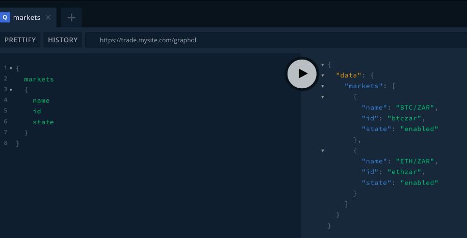

# Mobidax: GraphQL installation instructions

The instructions consist of 3 sections. The first is deploying the default GraphQL server to your installation. The second is sending requests to the GraphQL server, and the third is customizing your GraphQL server by adding an additional endpoint.

Inside the example folder you will find a copy of the template files required, as well as some additional notes that will help you with installation. There is also a doc with some example requests.

Note: These instructions are not intended to be a full tutorial on how to use GraphQL, for that you will need to upskill (there are plenty of free resources on the web). This doc is intended to get you started with running the already built Mobidax GraphQL docker image on your existing installation of the Opendax stack.

Assumptions:
- A working installation of Opendax
- Able to SSH into your server and access your installation of Opendax
- We’ve used the primary installation directory name of **opendax-staging** (all paths mentioned in the doc will use this as the root directory name)
- We’ve used **trade.mysite.com** as the example name of the installation
- A Github or Gitlab repo hosting your installation, of which you have access
- Working familiarity with how to use GIT source control
- A local cloned copy of the above repo, that you can modify
- Capability of modifying code, and using a code editor such as VC Code

Useful links:
- [What is GraphQL](https://graphql.org/)
- [Why use GraphQL](https://www.apollographql.com/blog/graphql/basics/why-use-graphql/)
- [Getting Started with GraphQL](https://www.apollographql.com/tutorials/)
- [GraphQL Playground](https://www.apollographql.com/docs/apollo-server/v2/testing/graphql-playground/)

Key definitions:
- [Schema fundamentals](https://www.apollographql.com/docs/apollo-server/schema/schema/#:~:text=Your%20GraphQL%20server%20uses%20a,available%20for%20clients%20to%20execute.)
- [Model / Graph](https://graphql.org/learn/thinking-in-graphs/#:~:text=the%20underlying%20process.-,With%20GraphQL%2C%20you%20model%20your%20business%20domain%20as%20a%20graph,types%20that%20reference%20other%20types.)
- [Type](https://graphql.org/learn/schema/)
- [Queries and Mutations]()
- [Resolver](https://www.apollographql.com/docs/apollo-server/data/resolvers/)


# Deploying Default GraphQL image

Deploying the GraphQL image is the same as deploying any other docker container to the stack - we need a docker-compose template and a config template. For Graphql, we will create a new config template, and modify the existing gateway.yaml.erb template to include the GraphQL service, and then deploy the updated stack to your server.

1. Open the Opendax folder (eg. opendax-staging) in your code editor, and navigate to the **COMPOSE** folder on the path /opendax-staging/templates/compose. You will notice existing template files, such as app.yaml.erb, backend.yaml.erb, gateway.yaml.erb, etc.
2. Open the **gateway.yaml.erb** template, and below the gateway service, create the GraphQL service as follows (for your convenience, see the the ready made compose file in the example folder, pay careful attention to the tab spacing/indentation of each line)

```yaml
version: '3.6'
 
services:
 gateway:
   restart: always
   image: envoyproxy/envoy:v1.10.0
   volumes:
     - ../config/gateway:/etc/envoy/
   command: /usr/local/bin/envoy -l debug -c /etc/envoy/envoy.yaml
   logging:
     driver: "json-file"
     options:
         max-size: "100m"
         max-file: "10"
 
   labels:
     - "traefik.http.routers.gateway-<%= @name %>.rule=Host(`<%= @config['app']['subdomain'] %>.<%= @config['app']['domain'] %>`) && PathPrefix(`/api`,`/admin`,`/assets/`)"
     - "traefik.enable=true"
     - "traefik.http.services.gateway-<%= @name %>.loadbalancer.server.port=8099"
     <%- if @config['ssl']['enabled'] -%>
     - "traefik.http.routers.gateway-<%= @name %>.entrypoints=websecure"
     - "traefik.http.routers.gateway-<%= @name %>.tls=true"
     - "traefik.http.routers.gateway-<%= @name %>.tls.certresolver=myresolver"
     <%- else -%>
     - "traefik.http.routers.gateway-<%= @name %>.entrypoints=web"
     <%- end -%>
 
 GraphQL:
   restart: always
   image: mobidax/core:GraphQL
   ports:
     - "4000:4000"
   volumes:
     - ../config/GraphQL/config.json:/config.json
  
   labels:
     - "traefik.http.routers.GraphQL-<%= @name %>.rule=Host(`<%= @config['app']['subdomain'] %>.<%= @config['app']['domain'] %>`) && PathPrefix(`/GraphQL`)"
     - "traefik.enable=true"
     - "traefik.http.services.GraphQL-<%= @name %>.loadbalancer.server.port=4000"
     <%- if @config['ssl']['enabled'] -%>
     - "traefik.http.routers.GraphQL-<%= @name %>.entrypoints=websecure"
     - "traefik.http.routers.GraphQL-<%= @name %>.tls=true"
     - "traefik.http.routers.GraphQL-<%= @name %>.tls.certresolver=myresolver"
     <%- else -%>
     - "traefik.http.routers.GraphQL-<%= @name %>.entrypoints=web"
     <%- end -%>
 
```
3. Save the file, then navigate to the opendax-staging/template/config folder, and create a new subfolder called **graphql**.
4. Copy the template **config.json.erb** from the example folder into the above subfolder.
5. Next, open the **opendax-staging/templates/config/gateway/envoy.yaml.erb** file
6. Under the routes section, add a new route for GraphQL as follows (pay close attention to the tab spacing / indentation, ensuring that this route indentation is consistent with the other routes):

```yaml
            routes:
             - match:
                 prefix: "/api/myapp"
               route:
                 cluster: myapp
                 prefix_rewrite: "/api"
             - match:
                 prefix: "/api/v2/admin/GraphQL"
               route:
                 cluster: GraphQL
                 prefix_rewrite: "/GraphQL"

```
7. Next, under the **Clusters** section in the same file (towards the bottom) add a new cluster for GraphQL (again paying strict attention to the tab spacing / indentation of the other clusters and ensure the GraphQL cluster has consistent tabbing to the other clusters),

```
    - name: GraphQL
        connect_timeout: 5.000s
        type: strict_dns
        lb_policy: round_robin
        hosts:
        - socket_address:
            address: GraphQL
            port_value: 4000
```

At this point, GraphQL should be configured correctly to be able to be reached by external requests. Next deploy these changes to your installation:

8. Save, commit, and push these changes to your installation:
    1. git add .
    2. git commit -m “feat: deploy GraphQL”
    3. git push

9. Next we’ll confirm that the changes are reflecting on your server.

    1. SSH into your machine
    2. From your opendax-staging folder, pull the latest updates and render them (if you have runners set up, this would likely already have been done for you)
        * git pull
        * rake render:config
  
    3. Pull the docker image:
        * docker pull mobidax/core:GraphQL
  
    4. Restart the Gateway service, which will start the newly added GraphQL service
        * docker-compose up -Vd gateway
  
    5. Check that GraphQL is running:
        * docker ps | grep GraphQL
        * Visit the GraphQL playground which should now be reachable:
            1. trade.mysite.com/graphql

10. You should now have the GraphQL server running on your server, and it should be accessible via external API calls. In the next section we will run some commands to test that everything is working as expected.

# Interacting with GraphQL

In this section we will interact with GraphQL, introducing the basic concept of how to interact, and send some test commands. GraphQL is a vast tool, and to use it correctly you will need to upskill on how to formulate commands and what the expected usage of it is. This is a primer only!

GraphQL is fundamentally made up of 2 types of requests. Queries and Mutations. Think of queries as GET requests, and mutations as POST / DELETE  / PUT requests. In other words, any request that intends to change (ie. ‘mutate’) data will be done via a **Mutation**. Any request that intends to only retrieve data without making changes (ie. ‘query’) is done via a **Query**. (This is a loose distinction between the two, there may be cases when the definitions overlap.)

If you are requesting private endpoints that require authentication, authentication will need to be provided in the request. Public endpoints as expected do not require authentication.

GraphQL works well for mobile applications, because you can specify exactly which data you want returned from that endpoint instead of returning the entire payload that might be available. For example, if you were to query the Markets endpoint using a classic RESTful API call, you would get back the name, id, state, base_currency, quote_currency, min_price, max_price etc etc the full complement of data that that endpoint provides. 

But let's say for example you have a screen in your app that needs only the market ID, name, and state. With REST you are forced to pull all the fields from the endpoint, and then only use 3 of them. A complete waste of bandwidth, time, server resources, and ultimately money. With GraphQL, you are able to specify the fields up front in your request that you want, and only those fields are returned. Great.

Lets try this out on the Market endpoint:

## Public endpoints (no authentication required)

First, visit the GraphQL playground at your site: **trade.mysite.com/GraphQL**

The left panel is where you input your requests, and the right is where you see the results. The play button in the middle executes the request.

Enter the following command in the left panel to get a list of markets, with their name, id and state, then hit the play button in the center to execute the command:

```graphql
{
  markets
  {
    name
    id
    state
  }
}
```

 


As you can see the data is returned in a nicely formatted JSON object that your app can interpret as needed.

Let's now also get the base and quote currencies:

```graphql
{
  markets
  {
    name
    id
    state
    base_currency
    quote_currency
  }
}
```

Running the request with additional fields will see the currencies returned too. 

If you click on the docs tab on the right next to the results you will be able to see the entire schema (all the fields) that are available to be queried. This is the GraphQL equivalent to the regular REST API documentation. One nice additional benefit of GraphQL is that any additional endpoints / changes you make to the server will automatically update in this schema, so you don’t have to worry about manually adding documentation for any changes that you make to the server.

Try experimenting with the other public endpoints, such as:
- currencies
- trades
- depth

##Private endpoints (Authentication is required)

Private endpoints require authentication, in other words the user needs to have an active Barong session, and have that Barong session token at hand (default name is: _barong_session).

Lets log in and get the _barong_session token:

To login, we will be using a Mutation, as opposed to the Query we used on the public endpoint.

```graphql
mutation{
  login(email: "admin@mysite.com",
        password:"changeme",
        otp_code: "123456")
  {
   _barong_session 
  }
}
```
Notice how we specify the *_barong_session* as the field we want returned to us.

Running the command will create a new session in Barong, and will return the token. This token will expire at some point, as per the Barong config.

We can now request private data by passing this auth token along with the requests, as well as specifying a parameter - in this case we want to get the BTC beneficiaries, so we pass currency: “btc” as the parameter, and the _barong_session token. Similar to a Query, we provide the fields we want returned, in this case id, currency, name, and state.

```graphql
{
  getBeneficiaries(_barong_session:"3b3922a05e5e5dc37aee1568e6239167",
  currency: "btc")
{
              id
    	  currency
  name
    	  state
  	}
}
```

The admin user will get returned a list of their beneficiaries.

Try running commands for the following endpoints:
- userOrders
- userTrades
- balances

***At this point, you should now be ready to begin developing your mobile app, or migrating your existing app to using GraphQL instead of the original Peatio / Barong REST API and gaining the performance benefits of GraphQL.***

# Modifying GraphQL

This section deals with adding your own endpoints to GraphQL. For our example we will add an endpoint that hits the database and retrieves bank deposit details for the specified currency. Reminder: this doc is not intended to be a tutorial on the best development practices or techniques, but a bootstrap to get you started with GraphQL on Opendax. Be warned, adding methods and modules directly to the GraphQL server that exposes your database comes with hopefully obvious risks, and should be managed and secured correctly. Always secure your endpoints, and manage the attack vectors. You have been warned!

## Custom GraphQL endpoint

Each custom endpoint should follow the pattern outlined below. Each folder that we create will contain 1x resolver.js and 1x schema.js file, within which we will describe all the endpoints that make sense for that folder category - again your architecture is up to you. 

- 001-bank-details (folder)
    * resolver.js (file)
    * schema.js (file)
- 002-onfido-kyc (folder)
    * resolver.js (file)
    * schema.js (file)

Before adding the endpoint to GraphQL, let's create a new table in our database, populate it with bank deposit details, and then we can query this table using GraphQL. 

Lets create a new table in your database, we’ll call it **bank_deposit_details** (you can add this table to a new DB schema, or simply add it to the Peatio DB by creating a migration etc - that is beyond the scope of this doc). Create the following columns for the table: 

- currency_id
- bank_name
- account_number
- account_name
- swift_code
- status
- created_at
- updated_at

Insert some data to create 2x records one for **usd** and one for **eur** as your currency_id’s.

Now that the table is set up, lets create the GraphQL endpoint that will access this table:

1. Open the GraphQL folder in your editor eg. VS Code
2. Create a new subfolder under the folder **/server/custom/** called **gql**
3. Inside the **gql** folder, create a subfolder called **001-get-bank-details**
4. Inside the **001-get-bank-details** folder create a new file called **resolver.js**
5. Inside the **001-get-bank-details** folder create a new file called **schema.js**
6. Copy and save the code from the example resolver.js file from the downloaded GraphQL folder in the subfolder named **Bank Details** Endpoint into the resolver.js file you just created.
7. Similarly, copy and save the code from the example schema.js file from the downloaded GraphQL folder in the subfolder named Bank Details Endpoint into the schema.js file you just created.
8. Notice that the **resolver** returns a JSON containing all the columns of the table. To optimize this query even further, and use the full power of GraphQL you could rewrite the Sequelize query to retrieve only the columns
requested in the GraphQL Query that was submitted, eg. if only the bank name is requested, then only select the bank name from the DB instead of selecting all. 
9. Take a look at the **schema.js**. Inside here we specify 2x types. 

   1. This first is the ‘model’ of the Query. In this instance it is the BankDepositDetails type, with the list of fields available.

   2. The second is the definition of the Query itself, here we give it a name (this is the name of the endpoint), and we also specify the parameters that are expected / required for the endpoint.

10. Now that we’ve added our custom endpoint, all that is left is to restart the GraphQL server, and we should then be able to query that endpoint.
    1. Restart GraphQL:
        * docker-compose up -Vd GraphQL

11. Once the server is restarted, refresh the GraphQL playground page **trade.mysite.com/graphql** and look for the new **getBankDepositDetails** endpoint in the docs or schema definitions on the right panel. If everything was done correctly, you should see the new **getBankDepositDetails** endpoint and the type it returns.
12. Try query the endpoint:
```graphql
{
  getBankDepositDetails(currency:"usd")
  {
    bankName
    currencyId
    accountName
  }
}
```

This should be enough to get you started with GraphQL, you can experiment further with adding your own authenticated endpoints (use the existing resolvers as examples located at **/server/src/resolvers.js**)